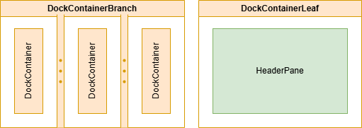
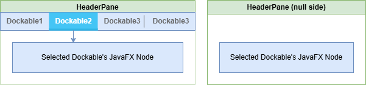
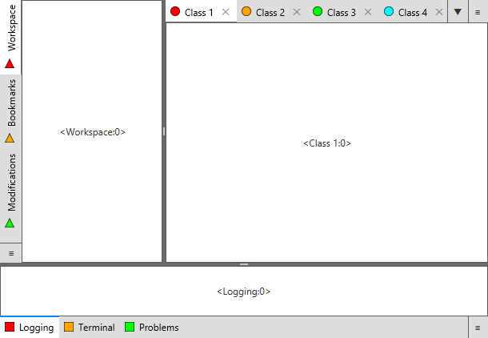
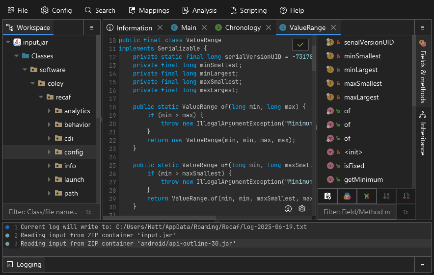

# BentoFX

A docking system for JavaFX.

## Usage

Requirements:

- JavaFX 19+
- Java 17+

Gradle syntax:

```groovy
implementation "software.coley:bento-fx:${version}"
```

Maven syntax:

```xml
<dependency>
    <groupId>software.coley</groupId>
    <artifactId>bento-fx</artifactId>
    <version>${version}</version>
</dependency>
```

## Overview


In terms of hierarchy, the `Node` structure of Bento goes like:

- `DockContainerRootBranch`
    - `DockContainerBranch` _(Nesting levels depends on which kind of implementation used)_
        - `DockContainerLeaf`
            - `Dockable` _(Zero or more)_

Each level of `*DockContainer` in the given hierarchy and `Dockable` instances can be constructed via a `Bento`
instance's builder offered by `bento.dockBuilding()`.

### Containers



Bento has a very simple model of branches and leaves. Branches hold additional child containers. Leaves
display `Dockable` items and handle drag-n-drop operations.

| Container type        | Description                                                                                                                                                             |
|-----------------------|-------------------------------------------------------------------------------------------------------------------------------------------------------------------------|
| `DockContainerBranch` | Used to show multiple child `DockContainer` instances in a `SplitPane` display. Orientation and child node scaling are thus specified the same way as with `SplitPane`. |
| `DockContainerLeaf`   | Used to show any number of `Dockable` instance rendered by a `HeaderPane`.                                                                                              |

### Controls



Bento comes with a few custom controls that you will want to create a custom stylesheet for to best fit the intended
look and feel of your application.

An example reference sheet _(which is included in the dependency)_ can be found
in [`bento.css`](src/main/resources/bento.css).

| Control                     | Description                                                                                                                                       |
|-----------------------------|---------------------------------------------------------------------------------------------------------------------------------------------------|
| `Header`                    | Visual model of a `Dockable`.                                                                                                                     |
| `HeaderPane`                | Control that holds multiple `Header` children, and displays the currently selected `Header`'s associated `Dockable` content.                      |
| `Headers`                   | Child of `HeaderPane` that acts as a `HBox`/`VBox` holding multiple `Headers`.                                                                    |
| `ButtonHBar` / `ButtonVBar` | Child of `HeaderPane` used to show buttons for the `DockContainerLeaf` for things like context menus and selection of overflowing `Header` items. |

### Dockable

The `Dockable` can be thought of as the model behind each of a `HeaderPane`'s `Header` _(Much like a `Tab` of
a `TabPane`)_.
It outlines capabilities like whether the `Header` can be draggable, where it can be dropped, what text/graphic to
display,
and the associated JavaFX `Node` to display when placed into a `DockContainerLeaf`.

## Example



In this example we create a layout structure that loosely models how an IDE is laid out.
There are tool-tabs on the left and bottom sides. The primary content like Java sources files
reside in the middle and occupy the most space. The tool tabs are intended to be smaller and not
automatically scale when we resize the window since we want the primary content to take up all
of the available space when possible.

We'll first create a vertically split container and put tools like logging/terminal at the bottom.
The bottom section will be set to not resize with the parent for the reason mentioned previously.

The top of the vertical split will hold our primary docking leaf container and the remaining tools.
The tools will go on the left, and the main container on the right via a horizontally split container.
The first item in this horizontal split will show up on the left, so that's where we'll put the tools.
Then the second item will be our primary docking container.

Our primary docking container is a glorified tab-pane, and we'll fill it up with some dummy items as if we
were in the midst of working on some project. These tabs won't have any special properties,
but we'll want to make sure the tools have some additional values set.

All tool tabs will be constructed such that they are not closable and all belong to a shared
drag group called `TOOLS`. Since these tabs all have a shared group they can be dragged
amongst one another. However, the primary docking container tabs with our _"project files"_ cannot be
dragged into the areas housing our tools. If you try this out in IntelliJ you'll find it
follows the same behavior.

```java
Bento bento = new Bento();
bento.placeholderBuilding().setDockablePlaceholderFactory(dockable -> new Label("Empty Dockable"));
bento.placeholderBuilding().setContainerPlaceholderFactory(container -> new Label("Empty Container"));
bento.events().addEventListener(System.out::println);
DockBuilding builder = bento.dockBuilding();
DockContainerBranch branchRoot = builder.root("root");
DockContainerBranch branchWorkspace = builder.branch("workspace");
DockContainerLeaf leafWorkspaceTools = builder.leaf("workspace-tools");
DockContainerLeaf leafWorkspaceHeaders = builder.leaf("workspace-headers");
DockContainerLeaf leafTools = builder.leaf("misc-tools");

// These leaves shouldn't auto-expand. They are intended to be a set size.
DockContainerBranch.setResizableWithParent(leafTools, false);
DockContainerBranch.setResizableWithParent(leafWorkspaceTools, false);

// Root: Workspace on top, tools on bottom
// Workspace: Explorer on left, primary editor tabs on right
branchRoot.setOrientation(Orientation.VERTICAL);
branchWorkspace.setOrientation(Orientation.HORIZONTAL);
branchRoot.addContainers(branchWorkspace, leafTools);
branchWorkspace.addContainers(leafWorkspaceTools, leafWorkspaceHeaders);

// Changing tool header sides to be aligned with application's far edges (to facilitate better collaps
leafWorkspaceTools.setSide(Side.LEFT);
leafTools.setSide(Side.BOTTOM);

// Tools shouldn't allow splitting (mirroring intellij behavior)
leafWorkspaceTools.setCanSplit(false);
leafTools.setCanSplit(false);

// Primary editor space should not prune when empty
leafWorkspaceHeaders.setPruneWhenEmpty(false);

// Set intended sizes for tools (leaf does not need to be a direct child, just some level down in the 
branchRoot.setContainerSizePx(leafTools, 200);
branchRoot.setContainerSizePx(leafWorkspaceTools, 300);

// Make the bottom collapsed by default
branchRoot.setContainerCollapsed(leafTools, true);

// Adding dockables to the leafs
leafWorkspaceTools.addDockables(
		buildDockable(builder, 1, 0, "Workspace"),
		buildDockable(builder, 1, 1, "Bookmarks"),
		buildDockable(builder, 1, 2, "Modifications")
);
leafTools.addDockables(
		buildDockable(builder, 2, 0, "Logging"),
		buildDockable(builder, 2, 1, "Terminal"),
		buildDockable(builder, 2, 2, "Problems")
);
leafWorkspaceHeaders.addDockables(
		buildDockable(builder, 0, 0, "Class 1"),
		buildDockable(builder, 0, 1, "Class 2"),
		buildDockable(builder, 0, 2, "Class 3"),
		buildDockable(builder, 0, 3, "Class 4"),
		buildDockable(builder, 0, 4, "Class 5")
);

// Show it
Scene scene = new Scene(branchRoot);
scene.getStylesheets().add("/bento.css");
stage.setScene(scene);
stage.setOnHidden(e -> System.exit(0));
stage.show();
```

For a more real-world example you can check out [Recaf](https://github.com/Col-E/Recaf/)


