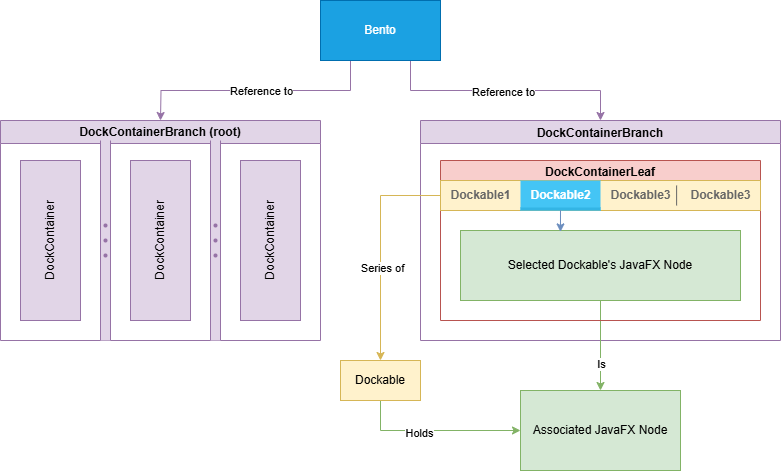

# BentoFX

A docking system for JavaFX.

## Usage

Requirements:
- JavaFX 19+
- Java 21+

Gradle syntax:
```groovy
implementation "software.coley:bento-fx:${version}"
```

Maven syntax:
```xml
<dependency>
    <groupId>software.coley</groupId>
    <artifactId>bento-fx</artifactId>
    <version>${version}</version>
</dependency>
```

## Overview



In terms of hierarchy, the `Node` structure of Bento goes like:

- `RootContentLayout`
  - `ContentLayout` _(Nesting levels depends on which kind of implementation used)_
    - `Content`
      - `Dockable` _(Zero or more, depending on the implementation of the containing `Content`)_

Each level of `*Content` in the given hierarchy can be constructed via a `Bento` instance's builder offered by `bento.newContentBuilder()`.

Each `Dockable` can be constructed via a `Bento` instance's builder offered by `bento.newDockableBuilder()`.

### Layouts


| Layout type           | Description                                                                                                                                                                                                                       |
|-----------------------|-----------------------------------------------------------------------------------------------------------------------------------------------------------------------------------------------------------------------------------|
| `SplitContentLayout`  | Used to show multiple child `ContentLayout` instances in a `SplitPane` display. Orientation can be specified at creation and child `ContentLayout` instances can choose if they auto-scale at construction via the builder model. |
| `LeafContentLayout`   | Used to show a single `Content` instance occupying the full space of the layout.                                                                                                                                                  |

### Contents


| Content type    | Description                                                                                                                                                                                                                                                                                                                                                                             | Supports drag-n-drop |
|-----------------|-----------------------------------------------------------------------------------------------------------------------------------------------------------------------------------------------------------------------------------------------------------------------------------------------------------------------------------------------------------------------------------------|----------------------|
| `TabbedContent` | Used to show multiple `Dockable` instances in a `HeaderView` display (similar to a `TabPane`). The tabs are able to be dragged and dropped to other `TabbedContent` instances, or externally to create a new window with a new `LeafContentLayout` holding a `TabbedContent` in the root layout. Orientation and other properties are configured at construction via the builder model. | :white_check_mark:   |
| `SingleContent` | Used to show a single `Dockable` instance occupying the full space of the content. A `Header` will be shown on a configured side of the content, however without the drag-n-drop capabilities of the `TabbedContent`.                                                                                                                                                                   | :x:                  |
| `EmptyContent`  | Used as a placeholder. It will display a value determined by the `Bento` instance's empty content factory.                                                                                                                                                                                                                                                                              | :x:                  |

### Dockable

The `Dockable` can be thought of as the model behind each of a `HeaderView`'s `Header` _(Much like a `Tab` of a `TabPane`)_. 
It outlines capabilities like whether the `Header` can be draggable, where it can be dropped, what text/graphic to display,
and the associated JavaFX `Node` to display when placed into a `Content`.

## Example

In this example we create a layout structure that loosely models how an IDE is laid out.
There are tool-tabs on the left and bottom sides. The primary content like Java sources files
reside in the middle and occupy the most space. The tool tabs are intended to be smaller and not
automatically scale when we resize the window since we want the primary content to take up all
of the available space when possible.

We'll first create a vertical split and put tools like logging/terminal at the bottom.
The bottom section will be set to not resize with the parent for the reason mentioned previously.

The top of the vertical split will hold our primary content and the remaining tools.
The tools will go on the left, and the main content on the right. To do this we set the top
of the vertical split to child horizontal split. The first item in this horizontal split will
show up on the left, so that's where we'll put the tools. Then the second item will be our
primary content layout.

In the primary content section, we'll put a tabbed layout with some dummy classes as if you
were in the midst of working on some project. These tabs won't have any special properties,
but we'll want to make sure the tools have some additional values set.

All tool tabs will be constructed such that they are not closable and all belong to a shared
drag group called `TOOLS`. Since these tabs all have a shared group they can be dragged
amongst one another. However, the primary content tabs with our _"project files"_ cannot be
dragged into the areas housing our tools. If you try this out in IntelliJ you'll find it
follows the same behavior.

```java
// Full code can be found in the "src/test" directory
Bento bento = Bento.newBento();
ContentBuilder builder = bento.newContentBuilder();
ContentLayout layout = builder.vsplit(
    builder.hsplit(
        builder.tabbed(
            new TabbedContentArgs()
                .setSide(Side.LEFT)
                .addDockables(
                    // "buildDockable(int, String)" is an alias for "builder.dockable()" with a dummy contents based on the int/string parameter
                    buildDockable(builder, 1, "Workspace").withClosable(false).withDragGroup(TOOLS),
                    buildDockable(builder, 2, "Bookmarks").withClosable(false).withDragGroup(TOOLS),
                    buildDockable(builder, 3, "Modifications").withClosable(false).withDragGroup(TOOLS)
                )
                .setResizeWithParent(false)
                .setAutoPruneWhenEmpty(false)
                .setCanSplit(false)
        ),
        builder.tabbed(
            Side.TOP,
            makeDockable(builder, 1, "Class1"),
            makeDockable(builder, 2, "Class2"),
            makeDockable(builder, 3, "Class3"),
            makeDockable(builder, 4, "Class4"),
            makeDockable(builder, 5, "Class5")
        )
    ),
    builder.tabbed(
        new TabbedContentArgs()
            .setSide(Side.BOTTOM)
            .addDockables(
                buildDockable(builder, 1, "Logging").withClosable(false).withDragGroup(TOOLS),
                buildDockable(builder, 2, "Terminal").withClosable(false).withDragGroup(TOOLS),
                buildDockable(builder, 3, "Problems").withClosable(false).withDragGroup(TOOLS)
            )
            .setResizeWithParent(false)
            .setAutoPruneWhenEmpty(false)
            .setCanSplit(false)
    )
);

// Create the root layout and put it in a new scene.
RootContentLayout root = builder.root(layout);
Scene scene = new Scene(root.getBackingRegion());
```